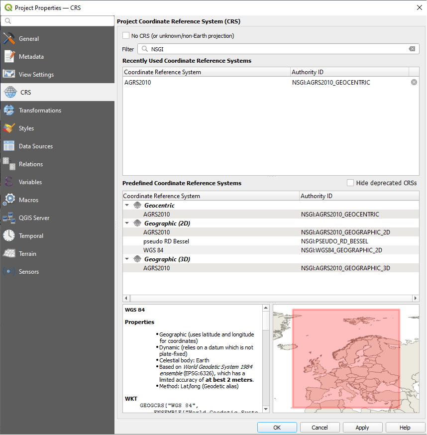

# NSGI coordinate reference system transformation examples

The [NSGI](https://www.nsgi.nl/) is responsible for the CRS (coordinate reference system) of the Netherlands and their relations with international CRSs. The NSGI also gives advices and guidance about the usage of these CRSs. The Guidance document (in: Dutch) ["Handreiking Gebruik coordinaatreferentiesystemen bij uitwisseling en visualisatie van geo-informatie"](https://docs.geostandaarden.nl/crs/crs/) and the [EPSG repository](https://epsg.org/home.html) has documented the advices and guidelines that are relevant for exchange and visualisation of geo information.

## Goal

The goal of this GitHub organisation and the repositories associated with it is to give a technical perspective into how to implement these advices and guidelines.

## Relations

The image below shows the relevant relations between the Dutch and international CRSs. The transformation path between these CRs can be ambiguous and dependent on the use case, especially for transformations between international and dynamic CRSs. NSGI has recommendations for the paths within the Netherlands. Defining these relations by making specific transformation rules within `proj.db` enables users to transform coordinates within the bounds of the European Netherlands, including the Exclusive Economic Zones in a more accurate and consistent way.


## Products

The products that are available, within the context of CRSs and their relations, are layered on top of each other. At the core of it sits the modified [`proj.db`](https://proj.org), at the edge of it sits the "final product"; the deployed [coordinate transformation API](https://api.transformation.nsgi.nl/v2/).

Working with CRSs and implementing these can be tricky. By showing this layering of different technical solutions, in the image below, we hope to provide a clear breakdown of the relations between the products that are available. It is also important to note that these products can be used on their own, and that this layering can be used as an example of how we used our products for deploying the [coordinate transformation API](https://api.transformation.nsgi.nl/v2/).


### :earth_africa: proj.db

The `proj.db` is a technical representation of the EPSG dataset. The `proj.db` is used by PROJ to implement these defined operations, making it possible to transform coordinates between CRSs. This makes the`proj.db` the first technical component available that can be modified. Other applications also leverage PROJ (and thus `proj.db`) for CRS handling and transformations (i.e. [QGIS](https://qgis.org/), [Mapserver](https://mapserver.org/), etc.). So if you want to change the CRS handling and transformations of these applications, then updating the `proj.db` would be the preferred technical solution.

> **example**
>
> ```bash
> curl -L -H "Accept: application/octet-stream" https://github.com/GeodetischeInfrastructuur/transformations/releases/download/1.0.0/proj.db -o proj.db
> ```

The modified `proj.db` is available to download through _github.com_ as:

1. [Dockerfile](https://github.com/GeodetischeInfrastructuur/transformations/blob/main/Dockerfile)
1. [Docker image](https://github.com/GeodetischeInfrastructuur/transformations/pkgs/container/transformations)
1. [Release download](https://github.com/GeodetischeInfrastructuur/transformations/releases)

### :mag: Geodense

A straight line in reality is usually not a straight line in a CRSs, the deflection in the CRS dependents on the location, orientation, length of line segments and the projection used for visualisations or computations. The deflection can cause inconsistency between the same data in different CRSs or compared to reality. To avoid topology issues line segments can be densified.

Geodense is used to check density and densify `LINESTRING` and `POLYGON` GeoJSON geometries. In other words, this tool can be used to check 'straightness' of a line and introduce new points to compensated for possible deviations that might occur when such a geometry is transformed from a cartographic to a geographic projection (and vice versa). It pre-processes certain geometry types so they are better suited for transformation.

> :exclamation: For context a `LINESTRING` in `EPSG:28992` that would have a length of over 2km could have a deviation of 5mm. With a line of 20km this can be 26cm. [[1]](https://gnss-data.kadaster.nl/misc/docs/langelijnenadvies.pdf)

For an example how to use Geodense one can look at [coordinate-transformation-api](https://github.com/GeodetischeInfrastructuur/coordinate-transformation-api).

> **example**
>
> ```bash
> pip install geodense
> ```
>
> ```python
> from geodense.lib import check_density_geometry_coordinates
> from geodense.models import DenseConfig
> from geodense.types import Nested, ReportLineString
> from geojson_pydantic import Feature
> from pyproj import CRS
>
> feature: Feature = {"type": "Feature","properties": {},"geometry": {"type": "LineString","coordinates": [[156264.906359842570964,601302.588919493253343],[165681.> 964475793502061,605544.313164469087496]]}}
> c = DenseConfig(CRS.from_epsg(28992))
> result: Nested[ReportLineString] = check_density_geometry_coordinates(feature['geometry']['coordinates'], c)
> print(result)
> ```

Geodense is available as:

1. [Code](https://github.com/GeodetischeInfrastructuur/geodense)
1. [PyPI package](https://pypi.org/project/geodense/0.0.1a9/)

### :computer: Coordinate Transformation API

> :warning: The Coordinate Transformation API makes use of pyproj. Pyproj has it's own PROJ 'build in' that needs to be updated. By default this can be found `/usr/local/lib/python3.11/site-packages/pyproj/proj_dir/share/proj/proj.db`.

The [coordinate-transformation-api](https://github.com/GeodetischeInfrastructuur/coordinate-transformation-api) is written in Python where the modified `proj.db` and Geodense are used together with specific code to create an API that will transform certain CRS and is focused on the European Netherlands including the Exclusive Economic Zones.

> :warning: The Coordinate Transformation API offers transformations that are not possible when using only PROJ.

The code for the Coordinate Transformation API is available at:

1. [github.com](https://github.com/GeodetischeInfrastructuur/coordinate-transformation-api)
1. [`Dockerfile`](https://github.com/GeodetischeInfrastructuur/coordinate-transformation-api/blob/main/Dockerfile)

### :whale2: Docker

A Docker image to run your own Coordinate Transformation API, as a backend service, is also available at _github.com_. Running the Coordinate Transformation API in your own container environment gives you full control over the availability of the API.

1. [Docker image](https://github.com/GeodetischeInfrastructuur/coordinate-transformation-api/pkgs/container/coordinate-transformation-api)

### :globe_with_meridians: Coordinate Transformation API

For demo purposes, we also host this Coordinate Transformation API on the following URL: [`https://api.transformation.nsgi.nl/v2/`](https://api.transformation.nsgi.nl/v2/). This can be used for none-production applications and should not be depended on for high availability.

> **example**
>
> :exclamation: For instance don't use this API in a test environment. The API will go down for maintenance, will throttle under 'high' load, and so on. This will impact the "test" results.
>
> :heavy_check_mark: For implementing these CRSs and transformations in a test environment either:
>
> 1. spin up a container with the Coordinate Transformation API
> 1. use the modified `proj.db` in the PROJ environment

1. [OpenAPI Specification](https://api.transformation.nsgi.nl/v2/openapi?f=html)

## API Conformance

The Coordinate Transformation API conforms to certain degree to the following specification:

| spec | compliance |
| --- | --- |
| OGC-API-Common | [report](https://github.com/GeodetischeInfrastructuur/coordinate-transformation-api/blob/main/docs/OGC-API-Common.md) |
| OGC-API-Features CRS | [report](https://github.com/GeodetischeInfrastructuur/coordinate-transformation-api/blob/main/docs/OGC-API-Features-CRS.md) |
| NL-API | [report](https://github.com/GeodetischeInfrastructuur/coordinate-transformation-api/blob/main/docs/NL-API.md) |
| KP-API geospatial | [report](https://github.com/GeodetischeInfrastructuur/coordinate-transformation-api/blob/main/docs/KP-API-geospatial.md) |

> :warning: The coordinate transformation API only transforms user input and doesn't contain something like a 'state'. It therefor doesn't conform to a traditional data object or feature collection API (like OGC API features), on which these specs (above) are primarily focussed. So specification requirements or recommendations focussed on certain type of query parameters cannot be applied. Reasoning to including these reports regarding compliance (at least our current assumption) is that this can/will be used in environments that so implement those kind of API's. Having these reports will highlight the differences and similarities between the API's

## Examples

### QGIS

The following instructions are for configuring QGIS on Windows to use the modified `proj.db` by GeodetischeInfrastructuur.

Steps:

1. Obtain PROJ data directory path: run following Python code from the QGIS Python console and copy paste the output:

    ```python
    import pyproj;print(pyproj.datadir.get_data_dir())
    ```

1. Close QGIS and download the modified `proj.db` and correction grids with the following PowerShell or Bash script (run in console/terminal with elevated privileges):

    ```powershell
    # powershell script
    $PROJ_DIR = XXXX  # use the proj data directory path obtained at step 1
    cp $PROJ_DIR\proj.db $PROJ_DIR\proj.db.bak # backup original proj.db
    invoke-webrequest -uri https://cdn.proj.org/nl_nsgi_nlgeo2018.tif -outfile "$PROJ_DIR\nl_nsgi_nlgeo2018.tif"
    invoke-webrequest -uri https://cdn.proj.org/nl_nsgi_rdcorr2018.tif -outfile "$PROJ_DIR\nl_nsgi_rdcorr2018.tif"
    invoke-webrequest -uri https://cdn.proj.org/nl_nsgi_rdtrans2018.tif -outfile "$PROJ_DIR\nl_nsgi_rdtrans2018.tif"
    $asset=Invoke-Webrequest -uri https://api.github.com/repos/GeodetischeInfrastructuur/transformations/releases/latest | ConvertFrom-Json | select -Expand assets | where-object { $_.name -eq 'proj.db'}
    Invoke-Webrequest -uri $($asset.url) -Headers @{'Accept'='application/octet-stream';} -outfile "$PROJ_DIR\proj.db"
    ```

    ```bash
    # bash script
    PROJ_DATA_DIR=XXXX # use the proj data directory path obtained at step 1
    cp $PROJ_DATA_DIR/proj.db $PROJ_DATA_DIR/proj.db.bak # backup original proj.db
    curl -sL -o "${PROJ_DATA_DIR}/nl_nsgi_nlgeo2018.tif" https://cdn.proj.org/nl_nsgi_nlgeo2018.tif
    curl -sL -o "${PROJ_DATA_DIR}/nl_nsgi_rdcorr2018.tif" https://cdn.proj.org/nl_nsgi_rdcorr2018.tif
    curl -sL -o "${PROJ_DATA_DIR}/nl_nsgi_rdtrans2018.tif" https://cdn.proj.org/nl_nsgi_rdtrans2018.tif
    curl -sL -H "Accept: application/octet-stream" $(curl -s "https://api.github.com/repos/GeodetischeInfrastructuur/transformations/releases/latest" | jq -r '.assets[] | select(.name=="proj.db").url') -o "${PROJ_DATA_DIR}/proj.db"
    ```

1. Synchronize the QGIS CRS database with the PROJ database with the following Batch or Bash script (run in console/terminal with elevated privileges). To start terminal session on Linux with maintaining current environment variables run `sudo -E su`:

    ```bat
    @echo off
    @rem "set QGIS_DIR to path of your qgis installation"

    set QGIS_DIR=C:\Program Files\QGIS 3.34.2
    call "%QGIS_DIR%\bin\o4w_env.bat"

    set QGIS_PREFIX_PATH=%QGIS_DIR%\apps\qgis
    copy "%QGIS_PREFIX_PATH%\resources\srs.db" "%QGIS_PREFIX_PATH%\resources\srs.db.bak"
    copy "%QGIS_PREFIX_PATH%\resources\qgis.db" "%QGIS_PREFIX_PATH%\resources\srs.db"
    set path=%QGIS_DIR%\bin;%QGIS_PREFIX_PATH%\bin;%path%

    "%QGIS_PREFIX_PATH%\crssync.exe" --verbose
    ```

    ```bash
    export QGIS_PREFIX_PATH=/usr
    export PROJ_LIB=$(python3 -c "import pyproj;print(pyproj.datadir.get_data_dir())") # should be /usr/share/proj
    QGIS_RESOURCES=/usr/share/qgis/resources
    cp $QGIS_RESOURCES/srs.db $QGIS_RESOURCES/srs.db.bak
    cp $QGIS_RESOURCES/qgis.db $QGIS_RESOURCES/srs.db
    /usr/lib/qgis/crssync --verbose
    ```

    The program `crssync` should print with a return code of `0`:

    ```txt
    Synchronizing CRS database with GDAL/PROJ definitions.
    13458 CRSs updated.
    ```


1. Verify if QGIS is using the modified `proj.db`. 

    1. Run the following Python script in the QGIS console, the output should read: _`proj db is configured correctly`_:

        ```py
        from pyproj import CRS, Transformer
        in_crs=CRS.from_epsg(7931)
        out_crs=CRS.from_epsg(28992)
        t=Transformer.from_crs(in_crs, out_crs, always_xy=True)
        input_point = (5,52, 43)
        expected_output_point = (128410.0958, 445806.496, 43.0)
        output_point=tuple(map(lambda x: float("{:.4f}".format(x)),t.transform(*input_point)))
        assert output_point == expected_output_point, f"expected output is {expected_output_point}, was {output_point}"
        print("proj db is configured correctly")
        ```

    1. QGIS should also show multiple CRSs with the authority `NSGI` in the __Project Properties - CRS__ window:

        


> **NOTE:** the original `proj.db` file can be restored by running the following (in an elevated Powershell console):
>
> ```powershell
> $PROJ_DIR = XXXX  # use the proj data directory path obtained at step 1
> cp $PROJ_DIR\proj.db.bak$ PROJ_DIR\proj.db # restore backup
> ```
